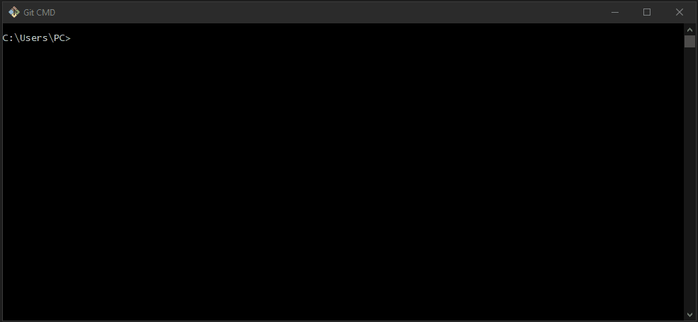

<h1 align="center">
  
</h1>

<h3 align="justify">
Academic demonstration of uploading files from the development environment via Git via CMD to the GitHub repository. Credits for the you tube channel I am Crys.
</h3>

 

## 📷 Demonstration

  

 

## 🚀 Technologies

This project was developed with the following technologies:

- Git
- GitHub

 

## ⚙ Settings
- cd ..
- cd
- rd .git /S/Q
- git init
- git add .
- git commit -m "mensage"
- git remote add origin "link repository"
- git push -u origin master
 

---

Made with 💜 by Rafael Maciel
